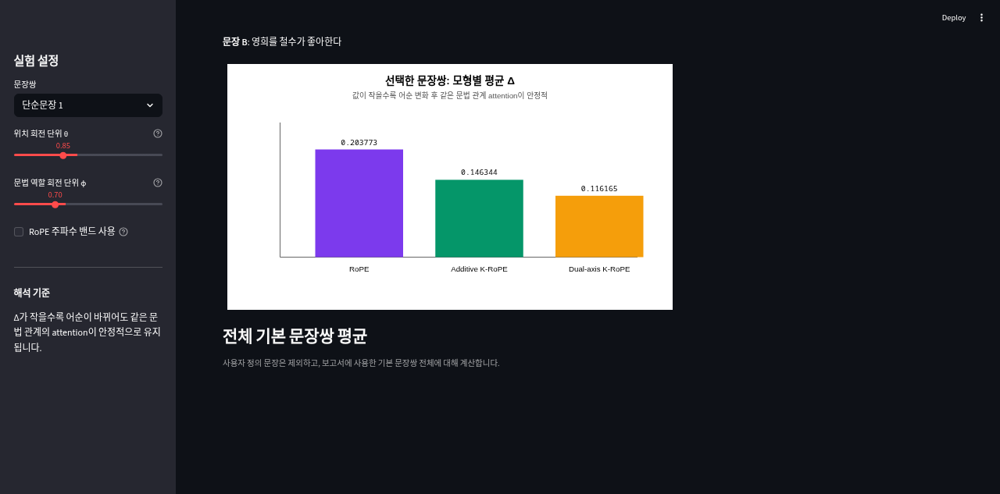

# K-RoPE Mini Simulator

본 프로젝트는 고등학교 **대수 수행평가**를 위해 제작한 교육용 Streamlit 시뮬레이터입니다. 일반 RoPE, 가산형 K-RoPE, 이중축 K-RoPE를 비교하여 한국어 어순 변화 상황에서 같은 문법 관계의 attention이 얼마나 안정적으로 유지되는지 시각화합니다.

This project is an educational Streamlit simulator for analyzing how RoPE-like rotary position encoding responds to Korean word-order changes and case-marker-based grammatical roles.



## 산출물

- 배포 앱: https://k-rope-simulator.streamlit.app/
- Streamlit 앱: `streamlit_app.py`
- 계산 코어: `krope_core.py`
- 수행평가 보고서: [`report/k_rope_report_hwp_tex.md`](report/k_rope_report_hwp_tex.md)
- 보고서용 그림: `report/figures/`

## 핵심 아이디어

RoPE는 위치 정보를 벡터에 단순히 더하지 않고, query/key 벡터를 위치에 따라 회전시킵니다.

```tex
x'=x\cos(i\theta)-y\sin(i\theta)
```

```tex
y'=x\sin(i\theta)+y\cos(i\theta)
```

두 위치 `i`, `j`를 비교하면 다음 구조가 나타납니다.

```tex
R(i\theta)^T R(j\theta)=R((j-i)\theta)
```

이 프로젝트에서는 한국어의 격조사와 문법 역할을 반영하기 위해 두 가지 K-RoPE 변형을 비교합니다.

```tex
\theta_i^K=i\theta+r_i\phi
```

```tex
R^K(i)=R(i\theta)\oplus R(r_i\phi)
```

값 `Δ`는 어순이 바뀐 두 문장에서 같은 문법 관계쌍의 attention 차이입니다. `Δ`가 작을수록 같은 문법 관계가 더 안정적으로 유지되었다고 해석합니다.

## 기능

- 기본 한국어 문장쌍 선택
- 사용자 정의 문장쌍 입력
- 일반 RoPE / 가산형 K-RoPE / 이중축 K-RoPE 비교
- 위치 회전 단위 `θ`, 문법 역할 회전 단위 `φ` 슬라이더
- attention heatmap 시각화
- 관계쌍별 `Δ=|A-B|` 표
- RoPE 회전 주파수 밴드 시각화
- TeX 수식 설명 포함

## 실행 방법

```bash
python -m venv .venv
source .venv/bin/activate
pip install -r requirements.txt
streamlit run streamlit_app.py
```

테스트 실행:

```bash
python -m unittest discover -s tests -v
```

## 프로젝트 구조

```text
k-rope-simulator/
├─ streamlit_app.py          # Streamlit UI
├─ krope_core.py             # 순수 수학/시뮬레이션 함수
├─ requirements.txt
├─ README.md
├─ tests/
│  └─ test_krope_core.py
├─ assets/
│  └─ demo_screenshot.png
└─ report/
   ├─ k_rope_report_hwp_tex.md
   └─ figures/
```

## 수학적 검증

테스트는 다음 성질을 확인합니다.

1. 2차원 회전은 벡터 길이를 보존한다.
2. RoPE의 상대 회전 항등식이 내적 계산에서 성립한다.
3. softmax 결과는 각 행의 합이 1이고 큰 수에서도 안정적이다.
4. RoPE 주파수는 등비수열 구조를 따른다.
5. 기본 문장쌍 전체에서 이중축 K-RoPE가 가장 작은 평균 `Δ`를 보인다.

기본 설정에서 전체 평균은 다음과 같습니다.

```text
RoPE: 0.131298
Additive K-RoPE: 0.114263
Dual-axis K-RoPE: 0.070550
```

## 한계

이 앱은 실제 LLM을 학습하거나 평가하는 도구가 아닙니다. 문장 토큰과 문법 역할은 교육용으로 직접 지정한 것이며, 벡터도 학습된 임베딩이 아니라 수학 구조를 설명하기 위한 단순화된 값입니다. 따라서 결과는 실제 한국어 LLM 성능 증명이 아니라, RoPE/K-RoPE 구조를 이해하기 위한 미니 시뮬레이션으로 해석해야 합니다.

## 보고서 연결 문장 예시

> 본 탐구에서는 Python으로 구현한 K-RoPE 미니 시뮬레이터를 Streamlit 웹 앱 형태로 확장하였다. 사용자는 문장쌍, 위치 회전 단위 $\theta$, 문법 역할 회전 단위 $\phi$를 직접 조절하며 일반 RoPE, 가산형 K-RoPE, 이중축 K-RoPE의 attention heatmap과 안정성 지표 $\Delta$를 비교할 수 있다. 이를 통해 삼각함수 회전, 등차수열적 위치각, 등비수열적 회전 주파수, softmax 정규화가 실제 계산 결과와 어떻게 연결되는지 시각적으로 확인하였다.
